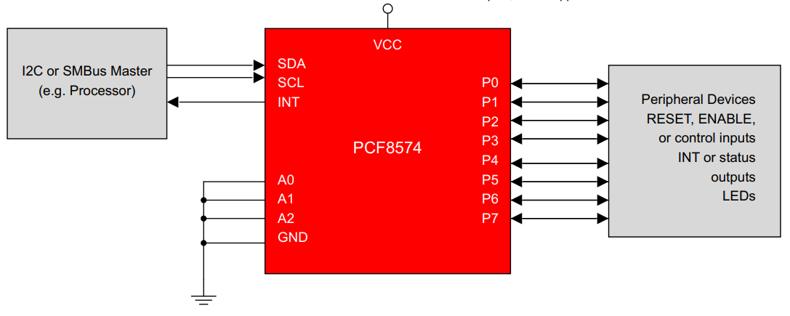
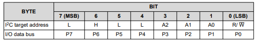
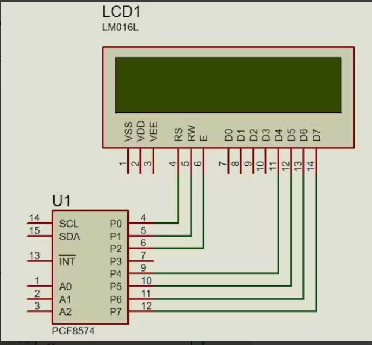

# LCD_TC1602_Driver

The **LCD1602** display is a simple yet powerful way to show text in embedded applications.

This is a driver  developed by my self, for the **STM32F407**, to control the **LCD1602** display with the **PCF8574 I/O expander**, the **I2C** protocol and the **HAL library**.


- The LCD is the `LCM1602`.

- The LCD use the `PCF8574` as a I2C interface.
	- Remote 8-Bit I/O Expander for I2C Bus.
	- **Remote set of 8 digital pins** that can be controlled using only **2 wires** from the microcontroller.
	- It is a `I2C slave`. 
	- To control outputs:
		1. Microcontroller sends **1 byte (8 bits)** via I2C
		2. Each **bit** corresponds to a pin:




- `PCF8574` Interface Definition.



# The LCM1602

## Pines

| Pin | Symbol              |     |
| --- | ------------------- | --- |
| 1   | GND                 |     |
| 2   | VDD                 |     |
| 3   | V0                  |     |
| 4   | RS                  |     |
| 5   | RW                  |     |
| 6   | E                   |     |
| 7   | DB0                 |     |
| 8   | DB1                 |     |
| 9   | DB2                 |     |
| 10  | DB3                 |     |
| 11  | DB4                 |     |
| 12  | DB5                 |     |
| 13  | DB6                 |     |
| 14  | DB7                 |     |
| 15  | A anode Backligth   |     |
| 16  | K cathode Backligth |     |

## Components

Inside the LCD1602:

- **IR (Instruction Register)**: 
	- Where you send commands (set cursor, clear display, set DDRAM address…).
    
- **DR (Data Register)**:
	- Temporary buffer for data that will go to or come from RAM.
    
- **DDRAM (Display Data RAM)**: 
	- Memory that holds one byte per visible character position
	- The controller continuously scans it and turns bytes into pixels on the glass.

## Operational Modes

- There are tow types of data operations: 
	- 4-bit.
	- 8-bit.

- For 4-bit data operation:
	- The interfacing 4-bit data is transferred by 4-busline (DB4～DB7).
	- The DB0 to DB3 lines are not used.
	- Using 4-bit MPU to interface 8-bit data **requires tow times transferring**. 
		- First, the higher 4-bit data is transferred by 4-busline (for 8-bit operation, DB7～DB4). 
		- Secondly, the lower 4-bit data is transferred by 4-busline (for 8-bit operation, DB3～ DB0). 

- For 8-bit MPU, the 8-bit data is transferred by 8-busline (DB0～DB7).

## Display Data RAM


## 4 Bits Modes

### `LCM1602` and `PCF8574` Connection



- **P0** is connected to the pin **RS** of the LCD. This RS pin is defines whether the transmitted byte is a **command (0) or Data (1)**.
- **P1** is connected to the **R/W** pin of the LCD. This pin should be **LOW** when writing the data to the LCD and **HIGH** when reading the data from the LCD.
- **P2** is connected to the **Enable** pin of the LCD. This pin is used for the **strobe** (E=1 & E=0).
- **P3** is connected to the Backlight of the Display. Setting this pin to 1 will turn the backlight ON.
- **P4 – P7** are connected to the data pins **D4 – D7**. Since only 4 data pins are available in the PCF8574, we need to configure the LCD in the **4bit Mode**.

### Data interpretation

- Remember:
	- `pin P0` is the **LESS SIGNIFICANT BIT** of the I2C.
	- `pin P0` connected to RS. 

- Using 4-bit MPU to interface 8-bit data **requires tow times transferring**. 
	- First, the higher 4-bit data is transferred by 4-busline (for 8-bit operation, DB7～DB4). 
	- Secondly, the lower 4-bit data is transferred by 4-busline (for 8-bit operation, DB3～ DB0). 

```
4 bits mode.
		
	  bit 7  bit 6  bit 5  bit 4  bit 3  bit 2  bit 1  bit 0
PIN    D7      D6     D5     D4    ...     E     RW     RS
```


- The data sent to the LCD is only valid if the `Bit E` is in **HIGH**.


### 1. Init LCD

1. **4 Bit Installation**

	1. Wait > 40 ms
	2. 
	```
	D7 D6 D5 D4   BackLight E  RW  RS
	0  0  1  1    0         0  0   0    = 0x30
	```
	3. Wait 4.1 ms
	4. 
	```
	D7 D6 D5 D4   BackLight E  RW  RS
	0  0  1  1    0         0  0   0    = 0x30
	```
	5. wait 100 us
	6. 
	```
	D7 D6 D5 D4   BackLight E  RW  RS
	0  0  1  1    0         0  0   0    = 0x30
	```
	7. 
	```
	D7 D6 D5 D4   BackLight E  RW  RS
	0  0  1  0    0         0  0   0    = 0x20
	```

2. **Display Installation**
	1. Function set --> DL=0 (4 bit mode), N = 1 (2 line display) F = 0 (5x8 characters)
		- `0x28`
	2. Display on/off control --> D=0,C=0, B=0 ---> display off
		- `0x08`
	3. clear display
		- `0x01`
	4. Entry mode set --> I/D = 1 (increment cursor) & S = 0 (no shift).
		- `0x06`
	5. Display on/off control --> D = 1, C and B = 0. (Cursor and blink, last two bits).
		- `0x0C`

### 2. Sent data

1. **Set DDRAM address.**
	
	- Example address: `0x80`. 
	
	-  **It requires tow data transmission**.
		1. First send high nibble `0x8`.
		2. Second send low nibble `0x0`.
	
	- In Each nibble:
		1. Put **RS = 0** (command).
		2. Put **RW = 0** (write).
    
	-  ==Each nibble: place bits on DB7..DB4, then toggle `E` high→low to latch it.==
	
	- **Inside the LCD:**
		- The command goes into the **Instruction Register (IR)**.
		- The LCD sets its **Address Counter (AC)** = `0x00`.
		- This AC marks “current cursor position” in DDRAM.
	
	- You still don’t see anything yet; you only told it where the next data should go.

2. **Send the data byte for the character**
	- Ex: ASCII for `A` is `0x41` (`0100 0001`).
	- To write this into DDRAM at the address we just set:
		1. Put **RS = 1** (data, not command).
		2. Keep **RW = 0** (write).
		3. Put `0x41` on the bus:
		    - In 4‑bit mode:
		        - First nibble: `0x4` (0100) on DB7..DB4, pulse `E`.    
		        - Second nibble: `0x1` (0001) on DB7..DB4, pulse `E`.
            
		4. After the second `E` pulse, the byte transfer is complete.
	- **Inside the LCD:**
		- The byte goes through the **Data Register (DR)** into **DDRAM[AC]**, so `DDRAM[0x00] = 0x41`.
		- Then the LCD **automatically increments AC** to `0x01` (assuming normal entry mode), ready for the next character.


